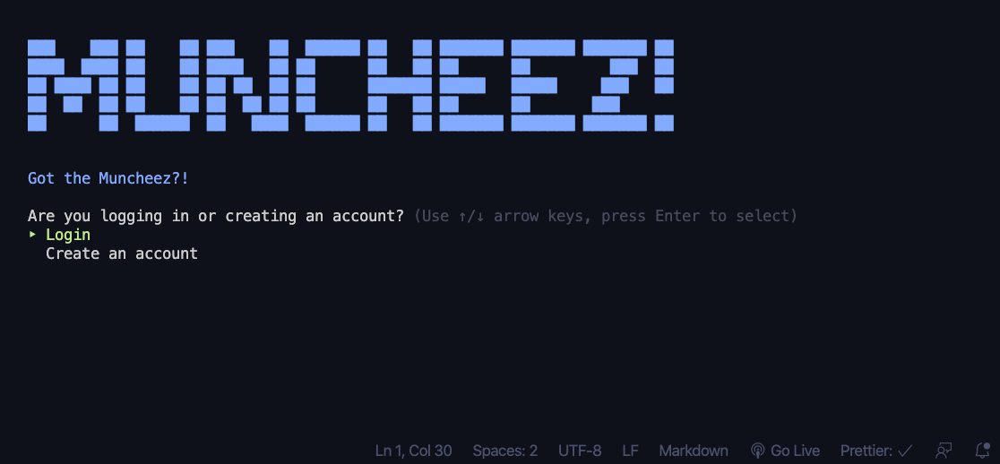

Muncheez! is a food ordering CLI app. Built using Ruby and Active Record.

## Getting Started

1. Clone this repository onto your local machine.
2. Run `bundle install` to download all the necessary gems.
3. Run `rake db:migrate` to create the database.
4. Run `rake db:seed` to seed the database with some auto-generated data.
5. Once you've installed everything smoothly, run `ruby bin/run.rb` to start the app!

## Built With

Here are some tools that I used to build Muncheez!

- [TTY::Prompt](https://github.com/piotrmurach/tty-prompt): interactive command line prompt
- [Colorize](https://github.com/fazibear/colorize): adds color to text and backgrounds
- [Faker](https://github.com/faker-ruby/faker): fake data generator
- [Text to ASCII Art Generator](http://patorjk.com/software/taag/#p=display&f=Graffiti&t=Type%20Something%20): generates ASCII art from inputted text
